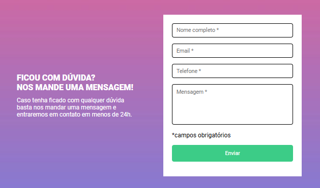
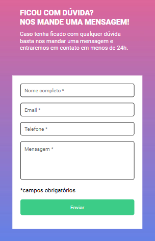
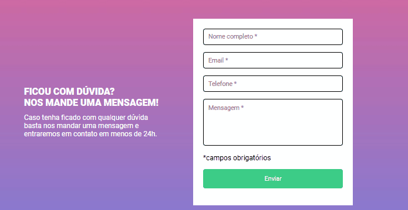

<h1>Projeto: Formulário de Contato Responsivo</h1>
<h2>Índice</h2>
        <ol>
            <li><a href="#introducao">Introdução</a></li>
            <li><a href="#estrutura">Estrutura do Projeto</a></li>
            <li><a href="#funcionalidades">Funcionalidades</a></li>
            <li><a href="#tecnologias">Tecnologias Utilizadas</a></li>
            <li><a href="#organizacao">Organização dos Arquivos</a></li>
            <li><a href="#como-executar">Como Executar o Projeto</a></li>
            <li><a href="#captura">Captura de Tela</a></li>
            <li><a href="#agradecimentos">Agradecimentos</a></li>
        </ol>

 <h2 id="introducao">Introdução</h2>

Este projeto consiste em uma página de formulário de contato simples e responsiva. Foi desenvolvido com HTML, CSS e JavaScript para oferecer validação básica de campos obrigatórios e adaptação a diferentes tamanhos de tela.

<h2>Estrutura do Projeto</h2>
<h3>1. HTML</h3>
 
O arquivo <code>index.html</code> contém a estrutura principal da página, incluindo:
 

<ul>
     <li>Um título e uma mensagem de introdução.</li>
     <li>Um formulário com os seguintes campos:
<ul>
    <li>Nome completo</li>
            <li>Email</li>
            <li>Telefone</li>
             <li>Mensagem</li>
         </ul>
           </li>
            <li>Botão de envio com validação.</li>
        </ul>

 <h3>2. CSS</h3>
        
O arquivo de estilos define:

        <ul>
            <li>Um layout responsivo que se adapta a dispositivos menores usando media queries.</li>
            <li>Estilização do formulário, inputs e mensagens de erro.</li>
            <li>Efeitos visuais no botão de envio e bordas dos inputs com base no estado (erro ou preenchido).</li>
        </ul>

<h3>3. JavaScript</h3>
        
O arquivo <code>formulario-verde.js</code> implementa:

        <ul>
            <li>Validação em tempo real dos campos do formulário.</li>
            <li>Feedback visual com bordas verdes para campos preenchidos corretamente e bordas vermelhas para campos inválidos.</li>
            <li>Exibição de mensagens de erro quando os campos obrigatórios não estão preenchidos.</li>
        </ul>

<h2>Funcionalidades</h2>
        <ul>
            <li><strong>Validação Dinâmica:</strong> Cada campo obrigatório é validado ao perder o foco ou ao clicar no botão "Enviar".</li>
            <li><strong>Feedback Visual:</strong> 
                <ul>
                    <li>Borda verde para campos válidos.</li>
                    <li>Borda vermelha e exibição de mensagens para campos inválidos.</li>
                </ul>
            </li>
            <li><strong>Design Responsivo:</strong> Layout que se adapta a telas menores, garantindo usabilidade em dispositivos móveis.</li>
        </ul>

<h2>Tecnologias Utilizadas</h2>
    <ul>
        <li><strong>HTML5:</strong> Para a estrutura da página.</li>
         <li><strong>CSS3:</strong> Para estilização, incluindo responsividade e transições.</li>
         <li><strong>JavaScript:</strong> Para validação de campos e interação do usuário.</li>
    </ul>

<h2>Organização dos Arquivos</h2>
        <ul>
            <li><code>index.html</code>: Arquivo principal contendo o formulário.</li>
            <li><code>src/css/reset.css</code>: Reset de estilos padrão do navegador.</li>
            <li><code>src/css/styles.css</code>: Estilos personalizados da página.</li>
            <li><code>src/js/formulario-verde.js</code>: Código de validação e interatividade do formulário.</li>
            <li><code>src/imagens/Group 9.png</code>: Imagem de fundo utilizada na página.</li>
        </ul>

<h2>Como Executar o Projeto</h2>
        <ol>
            <li>Clone o repositório ou faça download dos arquivos.</li>
            <li>Abra o arquivo <code>index.html</code> em qualquer navegador para visualizar o formulário.</li>
            <li>Certifique-se de que os caminhos relativos para os arquivos de CSS e JavaScript estão corretos.</li>
        </ol>
 <h2 id="captura">Captura de Tela</h2>
        

            <h3> Versão desktop:</h3> 
            
            <h3>Versão mobile:</h3>
              
            <h3>Interface do formulário de contato.</h3>
            

            
        

 <h2 id="agradecimentos">Agradecimentos</h2>
        

Agradeço à equipe do DevQuest pelo excelente material de estudo e por mais uma quest desafiadora, fundamental para colocar nossos conhecimentos em prática. Muito obrigado! 😊
